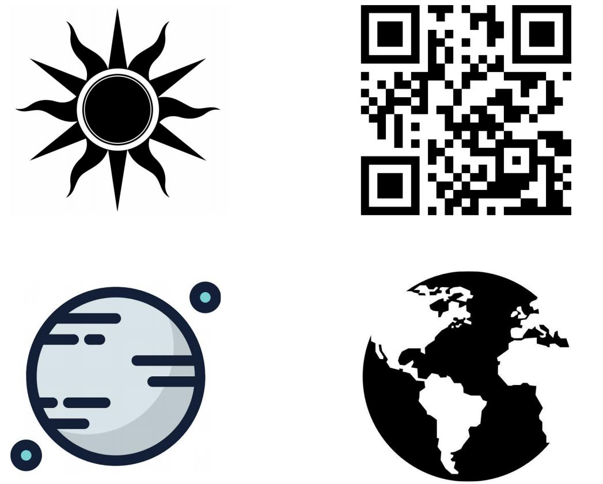
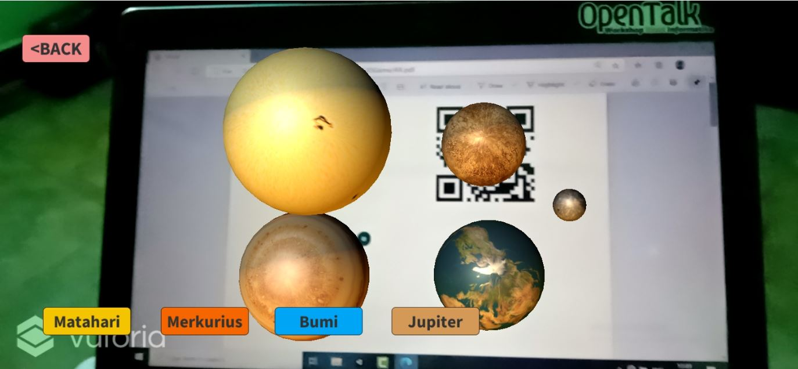
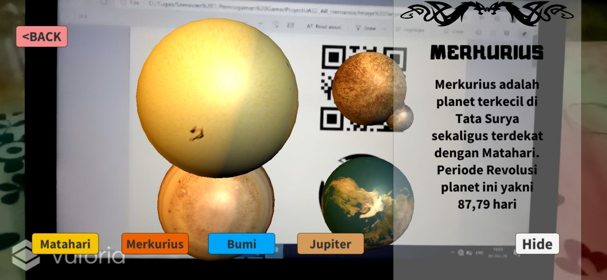
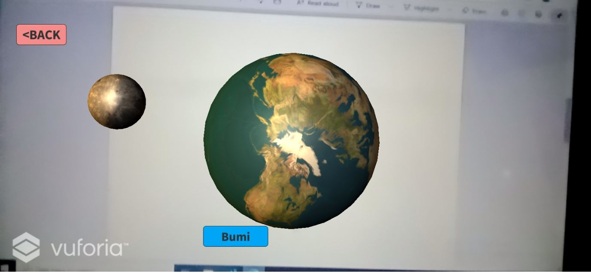
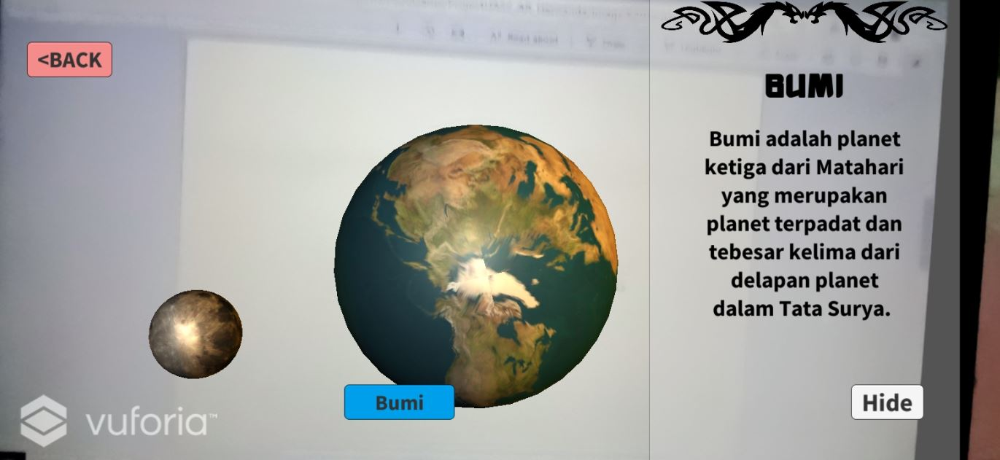

# Project UAS Pemrograman Game

## Link Youtube
https://youtu.be/LuO84y3H44Q

## Hasil Akhir
Tampilan Awal AR 
* Image Target  
  
* 4 Object  
  
* 4 Object & Panel 
  
* 1 Object  
  
* 1 Object & Panel  
  
* Tidak Ada Image Target  
  
 
 ## Source Code :
 * [gameController.cs](Assets/gameController.cs)  
   source code untuk menjalankan game (show & hide button, show & hide panel, sound)
 * [introController.cs](Assets/introController.cs)  
   source code untuk tampilan awal game (button start, button quit, sound)
   
## Assets
* [Image Target](Assets/Editor/Vuforia/ImageTargetTextures/uas_AR) 
* [Animation](Assets/Animation) 
* [Scenes](Assets/Scenes) 
* [Material](Assets/My%20Assets/Materials) 
* [Music and Image](Assets/My%20Assets) 
* [Font](Assets/font) 
